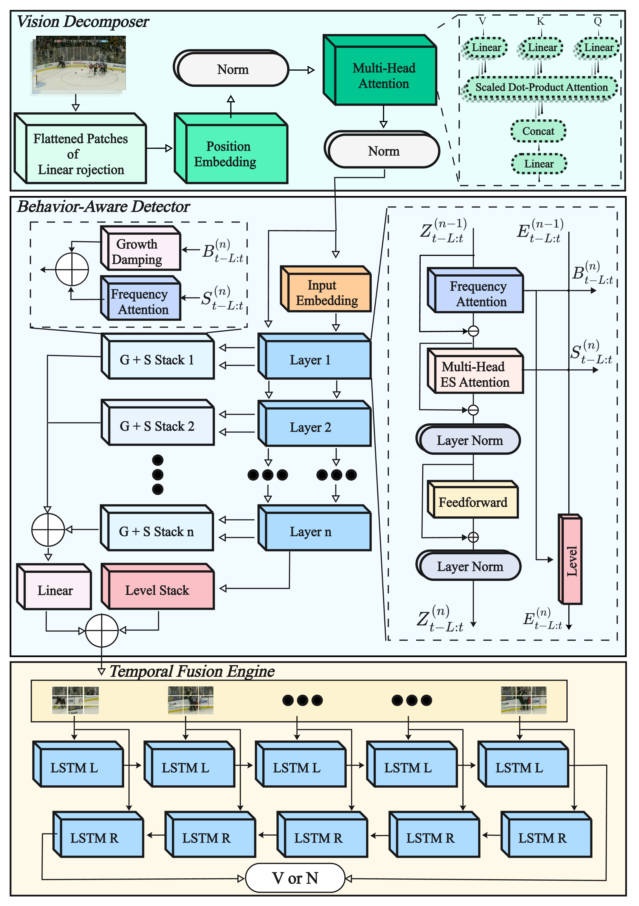

# TVT-ASTER: A Unified Spatiotemporal Reasoning Framework for Robust Sports Violence Detection

<p align="center">
  
</p>

Reliable detection of violent behaviors in sports is challenging due to the visual similarity between legitimate contact and intentional aggression under rapid motion, occlusion, and multi-agent interaction. With the growing use of vision sensors in stadiums and surveillance systems, robust frameworks are needed for accurate and efficient video analysis. We propose TVT-ASTER, a unified spatiotemporal reasoning framework combining a Vision Transformer for global spatial representation, an ETSformer for adaptive temporal attention, and a Bidirectional LSTM for causal sequence modeling. Experiments on HockeyFight, RLVS, and RWF-2000 achieve accuracies of 97.3\%, 96.7\%, and 86.7\%, surpassing state-of-the-art methods. These findings demonstrate the effectiveness and generalizability of TVT-ASTER and its potential for real-time deployment in intelligent vision sensor networks and automated officiating.

---

## 📁 Repository Structure

```
.
├─ train.py                     # entry: train/val/test + CLI
├─ models/
│  ├─ vit.py                    # ViT backbone 
│  ├─ etsformer.py              # ETSformer adapter 
│  ├─ bilstm.py                 # BiLSTM classification
│  ├─ model.py                  # ETSformer core
│  ├─ modules.py                # ETS embeddings & MLP 
│  ├─ exponential_smoothing.py  # smoothing kernels
│  ├─ encoder.py                # growth/season/level 
│  └─ decoder.py                # damping & prediction 
└─ utils/
   └─ data.py                   # dataset preparation: 
```

---

## 🔧 Installation

- Python **>= 3.10**
- CUDA-compatible PyTorch (install first according to your CUDA version)

```bash
git clone https://github.com/<your-org>/tvt-aster.git
cd tvt-aster

# install PyTorch that matches your CUDA
# CUDA 12.1:
pip install --index-url https://download.pytorch.org/whl/cu121 torch torchvision torchaudio

# then other deps
pip install -r requirements.txt
```

---

## 📦 Data Preparation

## Data Preparation

本项目使用三个公开数据集：**HockeyFight、RLVS（Real-Life Violence Situations）、RWF-2000**。请先下载原始视频到 `data/` 目录，再用脚本转换为标准化的 `.pt` clips。

### 1) HockeyFight
- Academic Torrents（常用镜像）：<https://academictorrents.com/details/38d9ed996a5a75a039b84cf8a137be794e7cee89>


#### 2) RLVS
-


### 1) Convert raw videos → `.pt` clips

Place raw datasets under `data/` (e.g., `data/HockeyFight`, `data/RLVS`). Then run:

```bash
# from project root
python -m utils.data
```

- It will enumerate videos, make **balanced splits**, sample **T frames** per video (default `T=32`), resize to `224×224`, normalize, and save to:
  - `data/pt-HockeyFight/{train,val,test}/*.pt`
  - `data/pt-RLVS/{train,val,test}/*.pt`
- You can modify `PROCESS_HOCKEY` / `PROCESS_RLVS` and arguments inside `utils/data.py` for your paths.
---

## 🚀 Training & Evaluation

### Train
```bash
python train.py \
  --data_root data/pt-HockeyFight \
  --epochs 15 --batch_size 8 \
  --lr_vit 2e-4 --lr_head_ets 5e-4 \
  --warmup_epochs 3 --cos_min_lr_factor 0.01 \
  --use_amp --use_ema \
  --weights_path weights/vit_b_16_imagenet1k_v1.pth \
  --out ckpts/hf_vit_ets_bilstm
```

Key arguments (selection):
- `--data_root`: path to prepared `.pt` dataset.
- `--epochs`, `--batch_size`
- `--lr_vit`, `--lr_head_ets`, `--weight_decay`
- `--warmup_epochs`, `--cos_min_lr_factor`
- `--use_amp`: enable `torch.amp` mixed precision.
- `--use_ema`: maintain EMA and use it for evaluation.
- `--weights_path`: local ViT-B/16 ImageNet-1k weights (`.pth`).

### Validation with threshold search

After each epoch, the pipeline:
1. Evaluates with τ=0.5 to collect probabilities.
2. Scans τ in `[0.30, 0.70]` to maximize F1 (val set).
3. Saves `best.pt` with **EMA weights** and the best threshold.

### Test
```bash
python train.py \
  --data_root data/pt-HockeyFight \
  --eval --ckpt ckpts/hf_vit_ets_bilstm/best.pt
```
- Automatically loads **EMA** weights and `best_threshold` from the checkpoint.
- Optional TTA (horizontal flip, time-roll) is available via flags (see `train.py`).

---

## 🧠 Model Overview

- **ViTBackbone (`models/vit.py`)**
  - Offline-friendly: load local weights via `--weights_path`, freeze early blocks.
  - Input `(B,3,T,224,224)` → output `(B,T,512)` through micro-batched frame encoding.

- **ETSFormerAdapter (`models/etsformer.py`)**
  - Wraps ETSformer core (`models/model.py`) to accept `(B,T,512)` and return `(B,T,512)`.
  - Temporal decomposition into **level/growth/season** with exponential smoothing & Fourier selection.

- **BiLSTMHead (`models/bilstm.py`)**
  - BiLSTM layers + pooling (mean/last/mean_last/attention) → linear classifier.

---

## 📊 Metrics

We report **Accuracy / Precision / Recall / F1** (positive=1). During validation, the **F1-optimal threshold** is searched on a fixed grid; test uses the saved `best_threshold`.

---

## 🔬 Ablations (examples)

```bash
# Change pooling
python train.py --pooling mean

# Reduce ETS heads / layers
python train.py --ets_heads 4 --ets_e_layers 2 --ets_d_layers 2

# Disable TTA at test time
python train.py --no_tta
```

---

## 📝 Notes & Tips

- Ensure your **PyTorch build matches CUDA**. Install PyTorch first, then `-r requirements.txt`.
- If GPU memory is tight: lower `--batch_size`, reduce frames in `utils/data.py`, or enable `--use_amp`.
- Store `.pt` datasets on fast SSD/NVMe for better throughput.

---

## 📄 License

This project is released under the **MIT License**. See `LICENSE` for details.

---

## 📚 Citation

If you find this repository helpful, please consider citing our paper (BibTeX placeholder):

```bibtex
@article{tvt-aster-2025,
  title   = {TVT-ASTER: A Unified Spatiotemporal Reasoning Framework for Robust Sports Violence Detection},
  author  = {Qin, Zhenkai and Fang, Qiao and Yang, Guifang and He, Jiajing and Jin, Ge and Zhang, Qian},
  year    = {2025},
  note    = {Code available at GitHub: https://github.com/<your-org>/tvt-aster}
}
```
